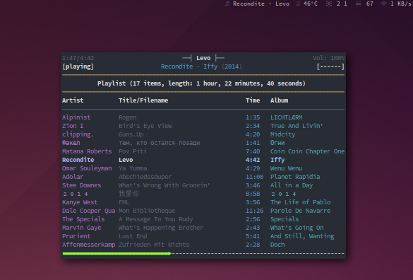

# Now Playing

Now Playing is a Python 3 script that queries Last.FM for the song you are
currently scrobbling. Its output can be used to determine what you are currently
listening disregarding of your used service or device.

You will have to set your [API key](www.last.fm/api/account/create) and user
name in the `data/data.json` file. After that, simply execute the script.

## Usage with polybar

You can use this script to display your playing music in a status bar such as
[polybar](https://github.com/jaagr/polybar).
[](polybar.png)

The following code shows an example for integrating this script with polybar as
shown in the screenshot above.
```ini
[module/now_playing]
type = custom/script

exec = "python $HOME/.scripts/now_playing.py"

tail = true

format = <label>
format-prefix = " "
format-prefix-foreground = ${colors.foreground}

label = %output:0:50%
```
